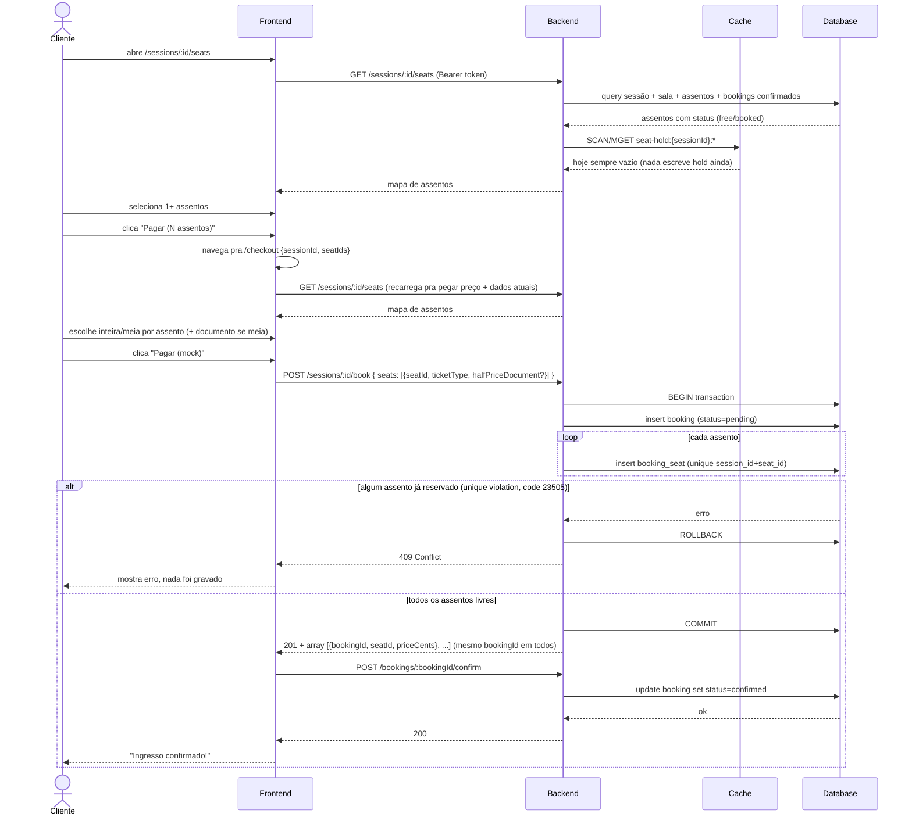

# Sequence: Reserva de assentos (booking)

Fluxo real de ponta a ponta hoje: cliente já autenticado escolhe assentos numa sessão, revisa no checkout e "paga" (mock). Cobre `SessionSeatsPage`/`CheckoutPage` (Frontend) → `BookingController`/`SeatingController`/`BookingService` (Backend) → Valkey (Cache) → Postgres (Database).

Sem hold via Valkey ainda — o `SeatingService` já lê chaves `seat-hold:*` no Cache pra decidir `held_by_other`/`held_by_me` (ver passo no seat map), mas nada escreve essas chaves hoje, então o Cache sempre volta vazio e esse ramo nunca dispara na prática (próxima story "Segurar assento").

## Fora do fluxo feliz

- **Token expirado** (`401` em qualquer chamada): front limpa o token e redireciona pra `/login`.
- **Desistência**: botão "← Voltar" tanto em `SessionSeatsPage` quanto `CheckoutPage` navega de volta sem chamar `/book` — como não há hold hoje, não há nada pra limpar no banco/Valkey. Quando o hold TTL existir, esse voltar vai precisar liberar a chave.

## Referências

- `apps/web/src/features/seating/SessionSeatsPage.tsx`, `apps/web/src/features/checkout/CheckoutPage.tsx`
- `apps/api/src/seating/seating.controller.ts`, `apps/api/src/seating/seating.service.ts`
- `apps/api/src/booking/booking.controller.ts`, `apps/api/src/booking/booking-confirmation.controller.ts`, `apps/api/src/booking/booking.service.ts`
